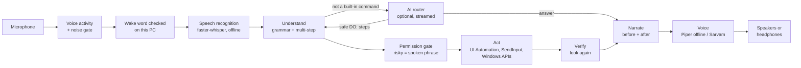

# RELAY — use your Windows PC by talking

**RELAY is a voice assistant that lets a blind or low-vision person use a Windows laptop
for everyday life — by talking.** It reads the screen through Windows UI Automation,
tells you what is there, does what you ask, checks that it worked, and tells you what
changed.

It is a **transparent operator, not an autonomous agent**: it acts only when you ask,
announces every action before doing it, verifies the result by looking again, and never
claims a success it didn't observe. Risky actions (sending, deleting, shutting down) need
a spoken confirmation phrase — a casual "yeah" never triggers them.


- **No keys, no account, no cloud needed.** Speech recognition (faster-whisper), the
  voice (Piper) and screen reading (UI Automation) run on the laptop. Online extras are
  optional and set up once by whoever installs it — users never need a key.
- **Built for basic laptops.** ~35 MB idle, ~400 MB peak, about 2.4 s from the end of a
  command to the first spoken word on an emulated budget dual-core (measured —
  [docs/PERFORMANCE.md](docs/PERFORMANCE.md)).
- **Instant AI answers (optional).** Anything its own commands don't cover goes to
  [FreeLLMAPI](https://github.com/tashfeenahmed/freellmapi) or any OpenAI-compatible
  router; the answer is spoken sentence by sentence while it is still being written.

---

## Try saying

| You want to… | Say |
|---|---|
| Know the basics | "what time is it" · "how's my battery" · "what's the weather in Hyderabad" · "how much storage is left" |
| Open anything | "open WhatsApp" · "open Antigravity" · "open my downloads" · "open YouTube" · "open Bluetooth settings" |
| Do several things at once | "open Notepad, type hello, then save it as notes" · "open Chrome and search for today's cricket score" · "search for weather in Delhi and read the first result" |
| Read | "read the page" (stop / continue / next paragraph / repeat) · "read the PDF electricity bill" · "next heading" · "read with OCR" |
| Write | "type Hello, how are you?" · "start dictation" … "stop dictation" · "select all" · "undo" · "save as report" |
| Windows | "what windows are open" · "switch to Chrome" · "minimize" · "close Notepad" · "close all windows" |
| The laptop | "turn on Bluetooth" · "turn off Wi-Fi" · "set brightness to 40 percent" · "turn on dark mode" · "take a screenshot" · "check for updates" |
| Files | in File Explorer: "rename this to report" · "move this to documents" · "delete this file" · "create a new folder called projects on the desktop" |
| Everyday | "what is 15 percent of 2 lakh" · "take a note buy milk" · "remind me in 10 minutes to call mom" · "set an alarm for 6 am" |
| Sound | "volume up" · "pause music" · "next track" · "speak slower" · "where is the sound going" |
| Safety | "stop" · "cancel" · "emergency stop" · risky actions ask for "confirm send", "confirm delete", "confirm shut down" |
| Ask anything *(AI extra)* | "what's a good name for a cat" · "explain what an index fund is" · "summarise this page" |

Speech recognition often misspells names — "Antigravity" may be heard as "anti gravity"
or "Andy gravity" — so apps are matched by how they **sound**. When RELAY isn't sure it
asks ("Did you mean Antigravity?") instead of guessing. Full list:
**[docs/USER_GUIDE.md](docs/USER_GUIDE.md)**. English only for now.

## Keys

| Key | What it does |
|---|---|
| **Ctrl+Alt+R** | start RELAY — press it **again to close** RELAY (like Narrator's Ctrl+Win+Enter) |
| **Ctrl+Alt+Space** | talk key, from any app: chirp, then speak (also interrupts RELAY) |
| *"Relay, …"* | hands-free wake word ("turn off the wake word" for talk-key only) |
| **Ctrl+Alt+Period** | stop talking / pause reading |
| **Ctrl+Alt+Backspace** | emergency stop — everything halts until you say "continue" |

**Headphones** (wired, USB-C, Bluetooth) are picked up automatically: RELAY's voice moves
to them, you can interrupt it just by talking, and if they're unplugged mid-reading it
pauses instead of reading private text out loud to the room.

## Quick start

### From source (developers)
```bash
uv venv --python 3.12 .venv
uv pip install -e ".[dev,voice,percept,daily]"
uv run python -m relay --setup-models   # voice + speech model, once (~140 MB); then offline
RELAY.cmd --install                     # desktop + Start-menu shortcut with Ctrl+Alt+R
RELAY.cmd --check                       # tests every part on this computer, says the result
```
Then press **Ctrl+Alt+R** from anywhere. `RELAY.cmd --autostart on` starts it at sign-in.

### Packaged app (no Python on the user's PC)
```powershell
powershell -ExecutionPolicy Bypass -File packaging\build.ps1
```
builds `dist\relay\` (relay.exe + models), runs the tests and a clean-profile check.
Copy the folder anywhere, run `relay-cli.exe --install` once — details in
[docs/PACKAGING.md](docs/PACKAGING.md).

### Optional: AI answers and the Sarvam voice
Copy `.env.example` to `.env` and paste the key(s):
```ini
RELAY_LLM_URL=http://127.0.0.1:31415/v1   # FreeLLMAPI desktop app (Docker/source: 3001)
RELAY_LLM_KEY=freellmapi-...              # from the Keys page of its dashboard
SARVAM_API_KEY=                           # optional: Sarvam's natural Indian voice
```
Each extra is independent — FreeLLMAPI alone is enough; if anything is offline, RELAY
says so once and keeps working with its own voice and commands. `RELAY.cmd --llm-check`
measures the time to the first spoken word. Setup, latency design, privacy, and what to
know before shipping one key to many users: [docs/AI_AND_VOICE.md](docs/AI_AND_VOICE.md).

## How it works



PERCEIVE (UI Automation, OCR fallback) → UNDERSTAND (offline grammar; several steps in
one request) → PLAN → ACT (one permission gate) → VERIFY (re-observe) → NARRATE
(announce before, report changes after) → RECOVER. A multi-step request is announced
first and stops at the first step that fails — it never types into the wrong window
because an app didn't open.

## Safety and privacy

- Nothing leaves the laptop unless you configure an online extra; `relay --check` proves
  the offline parts make no network lookups. `RELAY_OFFLINE=1` forces fully offline.
- Passwords, OTPs and PINs are never read aloud, logged, stored, or sent anywhere.
- With online speech recognition, the wake word is checked locally first, so room
  conversation is never uploaded.
- An AI-suggested action is untrusted: it must parse with the offline grammar, can
  never be a confirmation, emergency or delete phrase, is announced, and still passes
  the permission gate. Multi-step AI plans are all-or-nothing.
- RELAY never force-closes an app: "close" works like the window's X button, so unsaved
  work gets the app's own "save changes?" question, which RELAY reads out.
- Logs record the command type only, never what you said.

Details: [docs/SECURITY.md](docs/SECURITY.md).

## Tests and checks

```bash
uv run pytest -m "not integration"          # 383 unit and behaviour tests (all passing)
uv run python scripts/acceptance.py          # 8/8 offline acceptance checks passed
uv run python scripts/live_app_check.py      # assembled app: real mic, hotkeys, earcons, quit
uv run python scripts/live_window_check.py   # real window operations on its own test window
uv run python scripts/bench_basic_laptop.py  # emulated low-end laptops (CPU + memory caps)
uv run python -m relay --check               # this computer, end to end, spoken result
```

## Status and honest limits

Working and tested: everything above, on Windows 11 (real desktop runs recorded in
[docs/RELEASE_NOTES.md](docs/RELEASE_NOTES.md)). Not yet done:

- Supervised testing with blind users; NVDA/JAWS side-by-side testing.
- Clean-machine install on a separate PC, and a code-signed installer.
- Sending WhatsApp messages hands-free without the AI planner (do it step by step:
  click the contact, type, "send it" — which is read back and confirmed).
- Email is opened in Gmail on the web; no mail-app integration yet.
- `piper-tts` is GPL-3.0 — see [docs/THIRD_PARTY.md](docs/THIRD_PARTY.md) before
  distributing a packaged build.

## Documentation

[User guide](docs/USER_GUIDE.md) · [AI and voice](docs/AI_AND_VOICE.md) ·
[Security](docs/SECURITY.md) · [Performance](docs/PERFORMANCE.md) ·
[Packaging](docs/PACKAGING.md) · [Acceptance](docs/ACCEPTANCE.md) ·
[Release notes](docs/RELEASE_NOTES.md) · [Demo script](docs/DEMO_SCRIPT.md) ·
[Third-party licences](docs/THIRD_PARTY.md) · [SBOM](docs/SBOM.md)

## License

MIT — see [LICENSE](LICENSE). Small components adapted from the MIT-licensed
screen-use and clacky projects; see [NOTICE](NOTICE).
