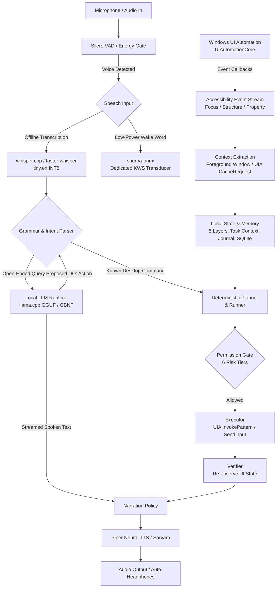

# Research: Cross-Project Architecture Lessons & Synthesis

## 1. Unified Conceptual Architecture Map

---

## 2. Where Event-Driven Architecture Replaces Polling

| Subsystem | Traditional (Flawed) Approach | Event-Driven Target (Adopted) | Impact |
|---|---|---|---|
| **Foreground Window Detection** | Polling `GetForegroundWindow()` every 100 ms | Hooking WinEvent `EVENT_SYSTEM_FOREGROUND` + UIA `FocusChangedEvent` | Eliminates continuous ~3–5% idle CPU waste. |
| **Wake Word Detection** | Running continuous Whisper transformer passes | Acoustic keyword spotter (sherpa-onnx KWS) or hotkey interrupt | Cuts idle RAM by ~100MB and CPU from 8% to <1%. |
| **Document State / Reading** | Re-traversing entire DOM / UIA tree per paragraph | `TextPattern` range selection with line bookmarks | Instant paragraph navigation (<5ms). |
| **Speech Barge-in** | Waiting for current TTS buffer to drain | Immediate hardware audio buffer flush on talk key / VAD speech trigger | Drop perceived interruption latency from ~400ms to <20ms. |
| **Frontend Mirror** | Browser polling HTTP `/status` every 500 ms | Server-Sent Events (SSE) `/events` push from engine EventBus | Instant mirror updates with zero network polling overhead. |

---

## 3. Core Trade-off Decisions: Adopted vs. Rejected

### What We Intentionally Adopt
1. **`IUIAutomationCacheRequest` Batch Queries** *(from Microsoft UIA)*:
   - Requesting element properties (Name, ControlType, AutomationId, ValuePattern) in a single COM transaction rather than multiple sequential cross-process calls.
2. **Deterministic Grammar First** *(from RELAY architecture)*:
   - All operating system commands bypass LLM inference entirely. Execution happens in `< 1 ms` with 100% deterministic reproducibility.
3. **Quantized Static Compute Graphs** *(from whisper.cpp)*:
   - INT8 quantized weights and pre-allocated tensor graphs to stay within the strict ~35 MB idle / ~400 MB peak RAM target.
4. **App-Specific Adaptation Layers** *(from NVDA `appModules`)*:
   - Cleanly isolating application quirks (e.g. Chrome accessibility DOM vs. Notepad edit controls) into modular adapters without polluting core logic.
5. **GBNF Grammar Constraints** *(from llama.cpp)*:
   - Restricting LLM outputs to valid schemas, preventing hallucinated actions from reaching the executor.

### What We Intentionally Reject
1. **In-Process DLL Injection** *(rejected from NVDA)*:
   - Injecting DLLs into target apps introduces antivirus blocks, stability hazards, and security elevation issues. RELAY stays strictly out-of-process via UIA.
2. **GPU-Dependent DirectML / CUDA Runtimes** *(rejected from heavy ML stacks)*:
   - Budget dual-core laptops often lack discrete GPUs or have outdated integrated graphics drivers. Highly optimized CPU vector code (AVX2) guarantees universal reliability and preserves battery.
3. **Continuous Audio Cloud Streaming** *(rejected from cloud voice assistants)*:
   - Continuous audio streaming compromises blind user privacy. The local pipeline guarantees that speech and screen content never leave the laptop.
4. **Unbounded Context Windows** *(rejected from modern web LLM chat)*:
   - Huge context windows exhaust laptop RAM. Context must be bounded to the active task and recent conversation turns.

---

## 4. Licensing & Legal Compliance Matrix

| Component / Project | License | Reusability in RELAY (MIT) | Policy |
|---|---|---|---|
| **Microsoft UI Automation** | Windows OS Native | Native API Usage | Standard system integration. |
| **whisper.cpp** | MIT | Full reuse / adaptation | Completely compatible. |
| **llama.cpp** | MIT | Full reuse / adaptation | Completely compatible. |
| **sherpa-onnx** | Apache-2.0 | Compatible | Permissible under Apache terms (attribution retained). |
| **NVDA** | **GPL-2.0** | **NO CODE REUSE** | **Strictly prohibited from copying or linking.** Conceptual design patterns only. |
| **Piper TTS** | MIT | Full reuse / adaptation | Completely compatible. |
